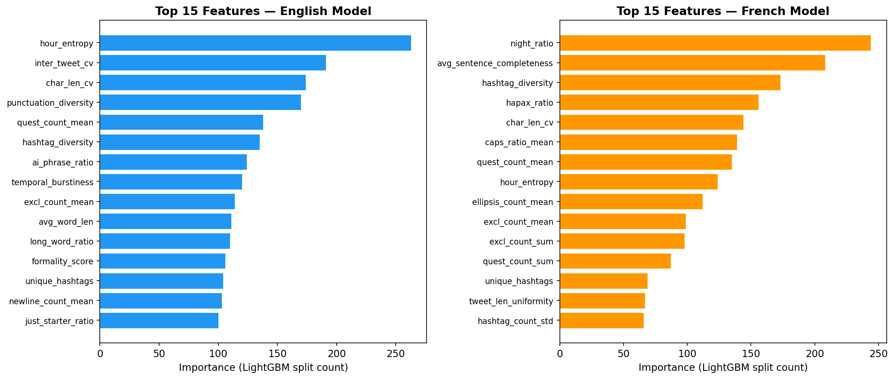
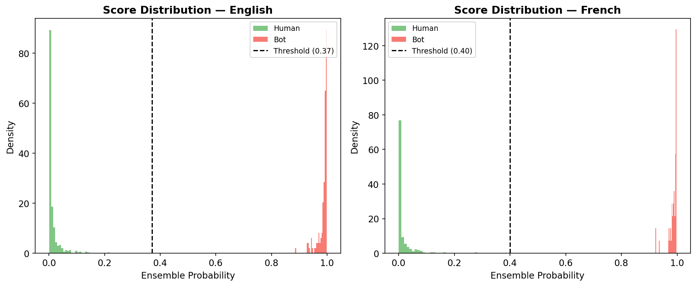
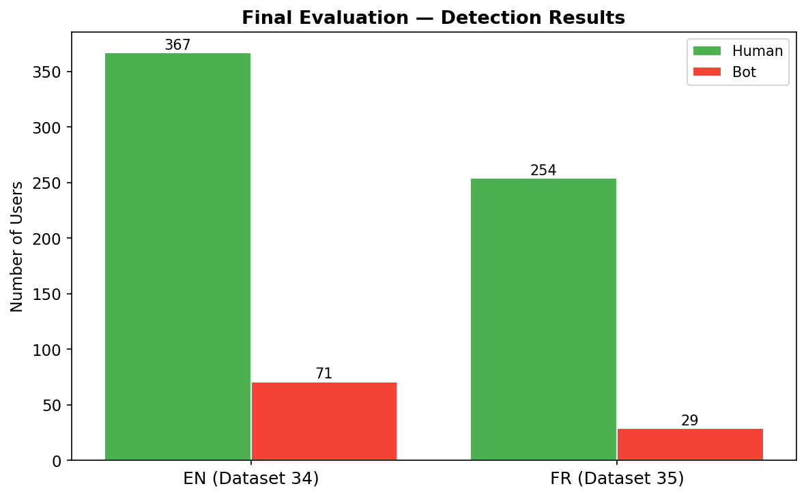

# Bot or Not Challenge — Team Cupid

## How It Works

Our detector uses a **two-phase pipeline**: deterministic hard rules followed by a 3-model ML ensemble, with language-specific models for English and French.

### Phase 1: Hard Rules

High-confidence heuristics that catch bot pipeline artifacts with near-zero false positive rates:

- **Garbled names** — non-printable characters in display names (broken Unicode from bot generation pipelines)
- **LLM output leakage** — literal prompt framing leaked into tweet text (e.g., "here are some of my recent tweets", "as an AI")
- **Systematic URL typos** — `htts://` instead of `https://` (copy-paste artifacts)
- **Weird location formats** — pipeline artifacts like `:null:`, `O:location:O`

### Phase 2: ML Ensemble

1. **Feature engineering (~100 features)** extracted per user across 7 categories:
   - Profile metadata (name length, description length, tweet count, z-score)
   - Aggregated text statistics (avg word count, caps ratio, emoji rate, URL/hashtag/mention density)
   - Temporal patterns (inter-tweet interval stats, hour entropy, night ratio, burstiness)
   - Text diversity & stylometry (lexical diversity, sentence length variance, formality score)
   - Hashtag analysis (diversity, generic hashtag usage)
   - Cross-user TF-IDF similarity (detect coordinated content)
   - AI-text detection markers (AI phrase ratio, artificial caps ratio, engagement bait patterns)

2. **3-model weighted ensemble:**
   - LightGBM (35%) — gradient boosting with strong regularization
   - XGBoost (35%) — gradient boosting with complementary hyperparameters
   - GradientBoosting (30%) — sklearn's implementation for diversity

3. **Language-specific models** — EN and FR models trained separately on their respective practice datasets, since bot behaviors differ by language (e.g., French bots post more at night)

4. **Threshold optimization** — 5-fold stratified cross-validation optimizing the custom competition score (`4*TP - 1*FN - 2*FP`), which penalizes false positives twice as much as missed bots

Final detections = union of hard rule hits + ML predictions above the optimized threshold.

### English vs French Differences

Both languages use the same code and architecture. The only difference is that models are trained separately on language-specific data, which allows them to learn language-specific bot patterns:
- EN bots tend toward engagement bait and persona-style AI generation
- FR bots show stronger night-posting patterns and different hashtag behaviors

## Usage

```bash
# Install dependencies
pip install lightgbm xgboost scikit-learn pandas numpy

# Train models on practice datasets (30-33)
python detect_bots.py --train

# Run inference on new data
python detect_bots.py <input.json> <output.txt>
```

## Reproduction

To reproduce our submission results:

```bash
python detect_bots.py "datasets/dataset.posts&users.34.json" cupid.detections.en.txt
python detect_bots.py "datasets/dataset.posts&users.35.json" cupid.detections.fr.txt
```

## Performance on Practice Data

**100% accuracy on all 4 practice datasets** (736/736 competition score).

Cross-dataset validation (train on one dataset, test on the other):

| Train | Test | Score | Accuracy | Precision | Recall |
|-------|------|-------|----------|-----------|--------|
| DS30 (EN) | DS32 (EN) | 199/252 | 95.2% | 0.931 | 0.857 |
| DS32 (EN) | DS30 (EN) | 236/264 | 96.0% | 0.877 | 0.970 |
| DS31 (FR) | DS33 (FR) | 102/112 | 98.8% | 1.000 | 0.929 |
| DS33 (FR) | DS31 (FR) | 108/108 | 100% | 1.000 | 1.000 |


## Feature Importance

The EN and FR models rely on different top features, reflecting language-specific bot behaviors:



## Score Distribution

The ensemble produces well-separated probability distributions for bots vs humans, with a clear decision boundary:



## Final Evaluation Results



## Repository Structure

```
├── detect_bots.py              # Bot detector (training + inference)
├── models.pkl                  # Trained model artifacts
├── datasets/                   # Practice (30-33) and eval (34-35) datasets
├── cupid.detections.en.txt     # EN submission (dataset 34)
├── cupid.detections.fr.txt     # FR submission (dataset 35)
├── generate_plots.py           # Plot generation script
├── plots/                      # Visualizations
└── README.md
```

## Dependencies

- Python 3.8+
- lightgbm
- xgboost
- scikit-learn
- pandas
- numpy
